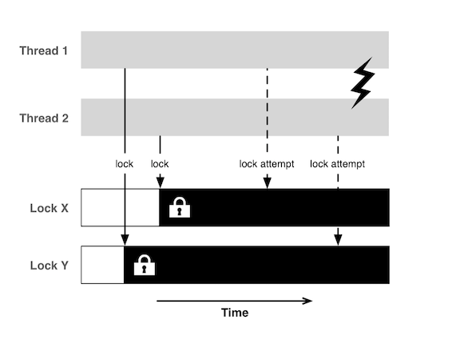

# Pitfalls
Github Class Repo ([link](https://github.com/Make-School-Courses/MOB-2.3-Concurrency-Parallelism-in-iOS/blob/master/Lessons/09-Pitfalls-Challenges/Lesson9.md))

Class Slides ([link](https://docs.google.com/presentation/u/2/d/1JvRyyZy50ndg0__U_dAQkIar78tIHrIJ_qK8FnL28SM/copy?id=1JvRyyZy50ndg0__U_dAQkIar78tIHrIJ_qK8FnL28SM&copyCollaborators=false&copyComments=false&includeResolvedCommentsOnCopy=false&title=Copy%20of%20L09&copyDestination=1fY3GqrOLSrg6bNkuKgAX7vvL-bRFv95a&token=AC4w5Vhos6RqPEXTBH013ywGjIgKbmZP8A%3A1561495643049&usp=slides_web))

> Working with the same variable on two different different threads can be unpredictable. But it can be avoided.

**Solution**

```Swift
private let countQueue = DispatchQueue(label: "countqueue")
private var count = 0
public var count: Int {
  get {
    return countQueue.sync {
      count
    }
  }
  set {
    countQueue.sync {
      count = newValue
    }
  }
}
```

# In class Activity
### What is Concurrency?

> Things happening at the same time.
* It allows you to run smaller / easier processes elsewhere from the main thread.
  * UI can be done quickly using concurrency


### What is Parallelism?
* Simultaneously running multiple processes.
* Parallelism uses concurrency to operate.
* Concurrency breaks down large tasks into multiple pieces. Parallelism takes individual pieces and processes them simultaneously.


### What are most commonly used APIs to implement concurrency in iOS?
* Grand Central Dispatch (GCD) is a low-level API for managing concurrent operations.
* It is an implementation of task parallelism based on the Thread Pool design pattern.


### What is a queue? What is their relationship with FIFO?
> In Computer Science, a queue is a data structure that manages a collection of objects in FIFO 3 order, where the first object added to the queue is the first object removed from (executed by) the queue.


In GCD, `DispatchQueue` is a queue object that manages the execution of tasks on your app's `main` thread or on a `background thread`.

It is a FIFO queue to which your application can submit tasks in the form of block objects (functions or closures).

FIFO = First in, first out.

### What are all the different types of queues and their priorities?
* Operations within an operation queue are organized according to their `readiness`, `priority level`, and `dependencies`, and are executed based on those criteria.
* `You can set priority on individual operations`. Those with the highest priority get pushed ahead, but not necessarily to the front of the queue.
* `Operations with the same priority get executed in the order they were added to the queue` — unless an operation has dependencies, which allow you to define that some operations will only be executed after the completion of the other operations they are dependent on.


### What is the difference between an asynchronous and a synchronous task?
In synchronous execution by sync method the current thread waits until the task finished before the method call returns. In asynchronous execution by async method, the method call returns immediately. Never call sync method in the main queue which will cause deadlock of the app.

Asynchronous tasks are started by one thread but actually run on a different thread, taking advantage of additional processor resources to finish their work more quickly. (from Apple )

### What is the difference between a serial and a concurrent queue?
Serial Queues:
- only have a __*single thread*__ associated with them and thus only allow a single task to be executed at any given time.
- execute tasks in the order they are submitted, one at a time. <sup>1</sup>

On the other hand, a **concurrent queue** is able to utilize as many threads as the system has resources for.

For Concurrent Queues:
- threads will be created and released as needed for a concurrent

### How does GCD work?
> GCD works by allowing specific `tasks` — functions or closures — that can be run in parallel to be `queued up` for execution and, depending on availability of processing resources, `schedule` them to execute on any of the available processor cores (referred to as "routing" by Apple). 1

> GCD abstracts the notion of threads, and exposes `dispatch queues` to handle `work items` (work items are blocks 2 of code that you want to execute). These tasks are assigned (dispatched) to a dispatch queue, which processes them in a `First-In-First-Out (FIFO) order`.

> Note: Apple's documentation sometimes refers to a block in lieu of a closure because block was the name used in Objective-C. In the context of concurrency in iOS, you can consider block and closure interchangeable> [action]


### Explain the relationship between a process, a thread and a task.
#### What is a process?
* The runtime instance of an application. A process has its own virtual memory space (aka, virtual machine) and system resources (including port rights) that are independent of those assigned to other programs.
* A process always contains at least one thread (the main thread) and may contain any number of additional threads.

#### What is a thread?
* A flow of execution inside a process. A thread of execution is the smallest sequence of programmed instructions that can be managed independently by the operating system's scheduler.
* Each thread comes with its own stack space but otherwise shares memory with other threads in the same process.
* A thread defines a discrete mechanism, within a single process, for executing tasks.
* Threads can execute concurrently, but that is up to the operating system.

<br>

| `Processes` | `Threads` |
| ------------- | ------------- |
| Are typically independent | Threads exist as *subsets* of a process |
| Have separate address spaces | Threads share their address space with other threads in the same process |
| Carry considerably more state information than threads  | Multiple threads within a process share process state as well as memory and other resources  |


#### Where do tasks run?
> On threads

* The UI is built in the main thread.
* Other tasks are automatically created by the system.
* An app can use threads or create its own.

#### What is Parallelism?
* Simultaneously running multiple processes.
* Parallelism uses concurrency to operate.
* Concurrency breaks down large tasks into multiple pieces. Parallelism takes individual pieces and processes them simultaneously.

### Are there any threads running by default? Which ones?
Main Thread.

### How does iOS support multithreading?
> Multi-core devices execute multiple threads at the same time via Parallelism.

### What is NSOperation? and NSOperationQueue?
`NSOperation` represents a single unit of work. It’s an abstract class that offers a useful, thread-safe structure for modeling state, priority, dependencies, and management.

`NSOperationQueue` regulates the concurrent execution of operations. It acts as a priority queue, such that operations are executed in a roughly First-In-First-Out manner, with higher-priority (NSOperation.queuePriority) ones getting to jump ahead of lower-priority ones. `NSOperationQueue` can also limit the maximum number of concurrent operations to be executed at any given moment, using the maxConcurrentOperationCount property.

### What is QoS?
* `Quality of Service (QoS) Priority - as defined by Apple for iOS/macOS` -  By assigning a QoS to work, you indicate its importance, and the system prioritizes it and schedules it accordingly.

### Explain priority inversion.
`Priority Inversion` - When high-priority work becomes dependent on lower priority work, or it becomes the result of lower priority work, a priority inversion occurs. As a result, blocking, spinning, and polling may occur.

### Explain dependencies in Operations.
> It allows to pass data from one operation to the next.

Let's say you need to download a picture, process it and then present it.

You can use dependencies to start processing the picture once it's downloaded.

### When do you use GCD vs Operations?
**When to Use NSOperation**
The NSOperation API is great for encapsulating well-defined blocks of functionality. You could, for example, use an NSOperation subclass to encapsulate the login sequence of an application.
Dependency management is the icing on the cake. An operation can have dependencies to other operations and that is a powerful feature Grand Central Dispatch lacks. If you need to perform several tasks in a specific order, then operations are a good solution.
You can go overboard with operations if you are creating dozens of operations in a short timeframe. This can lead to performance problems due to the overhead inherent to the NSOperation API.


**When to Use Grand Central Dispatch**
Grand Central Dispatch is ideal if you just need to dispatch a block of code to a serial or concurrent queue. If you don't want to go through the hassle of creating an NSOperation subclass for a trivial task, then Grand Central Dispatch is a great alternative. Another benefit of Grand Central Dispatch is that you can keep related code together. Take a look at the following example.

source ([link](https://cocoacasts.com/choosing-between-nsoperation-and-grand-central-dispatch))

### How do we know if we have a race condition?
`Race condition` is an undesirable situation that occurs when a device or system attempts to perform two or more operations at the same time, but because of the nature of the device or system, the operations must be done in the proper sequence to be done correctly.

### What is deadlock?
A **deadlock.** occurs when two or more tasks are waiting on each other to finish and get stuck in a never-ending cycle. Neither can proceed until the other completes; but, since neither can proceed, neither will finish.

A **deadlock** can occur even when the perpetually-waiting tasks are on the same thread.



### What is context switching in multithreading?
`Context switch` is the process of storing the state of a process or of a thread, so that it can be restored and execution resumed from the same point later. This allows multiple processes to share a single CPU, and is an essential feature of a multitasking operating system.

### What are the ways we can execute an Operation? How are they different?
`NSOperation` represents a single unit of work. It’s an abstract class that offers a useful, thread-safe structure for modeling state, priority, dependencies, and management.

`NSOperationQueue` regulates the concurrent execution of operations. It acts as a priority queue, such that operations are executed in a roughly First-In-First-Out manner, with higher-priority (NSOperation.queuePriority) ones getting to jump ahead of lower-priority ones. `NSOperationQueue` can also limit the maximum number of concurrent operations to be executed at any given moment, using the maxConcurrentOperationCount property.

### What is DispatchSemaphore and when can we use it?
A DispatchSemaphore has two components:
* A threads queue - used by the semaphore to keep track on waiting threads in FIFO order (The first thread entered to the queue will be the first to get access to the shared resource once it is available).
* A counter value - used by the semaphore to decide if a thread should get access to a shared resource or not. The counter value changes when we call signal() or wait() functions.

### What happens if you call sync() on the current or main queue?
Doing so will deadlock the queue
