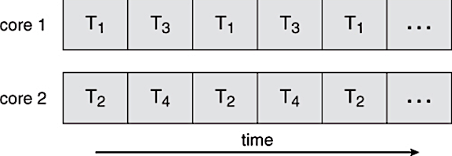
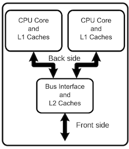

# MOB 2.3 Introduction
[Github Link](https://github.com/Make-School-Courses/MOB-2.3-Concurrency-Parallelism-in-iOS/blob/master/Lessons/01-Intro-Concurrency-&-Parallelism/Lesson1.md)

**Q:** Why do apps need concurrent activities?

**A:** To keep the UI responsive.



## What is Concurrency?
> Things happening at the same time.
* It allows you to run smaller / easier processes elsewhere from the main thread.
  * UI can be done quickly using concurrency

### What is a process?
* The runtime instance of an application. A process has its own virtual memory space (aka, virtual machine) and system resources (including port rights) that are independent of those assigned to other programs.
* A process always contains at least one thread (the main thread) and may contain any number of additional threads.

### What is a thread?
* A flow of execution inside a process. A thread of execution is the smallest sequence of programmed instructions that can be managed independently by the operating system's scheduler.
* Each thread comes with its own stack space but otherwise shares memory with other threads in the same process.
* A thread defines a discrete mechanism, within a single process, for executing tasks.
* Threads can execute concurrently, but that is up to the operating system.

<br>

| `Processes` | `Threads` |
| ------------- | ------------- |
| Are typically independent | Threads exist as *subsets* of a process |
| Have separate address spaces | Threads share their address space with other threads in the same process |
| Carry considerably more state information than threads  | Multiple threads within a process share process state as well as memory and other resources  |


## Where do tasks run?
> On threads

* The UI is built in the main thread.
* Other tasks are automatically created by the system.
* An app can use threads or create its own.

## What is Parallelism?
* Simultaneously running multiple processes.
* Parallelism uses concurrency to operate.
* Concurrency breaks down large tasks into multiple pieces. Parallelism takes individual pieces and processes them simultaneously.

### Multiple Processors / Cores
> A two Core Processor:



> Multi-core devices execute multiple threads at the same time via Parallelism.

### *Time slicing* is splitting tasks into multiple threads.

## How many cores on an iOS device?
`2 - 12 Cores depending on exact device`
> There can be as many threads executing at once as there are cores in a device's CPU. <br><br>
iPhones and iPads have been dual-core since 2011, with more recent models boasting as many as 8 cores per chip (see *octa-core* in <sup>1</sup>).<br><br>
With more than one core available, iOS apps are capable of running more than a single task at the same time.<br><br> (Potentially, up to 8 tasks simultaneously, though this again is ultimately up to the operating system).

## What is GCD (Grand Central Dispatch)?
* Grand Central Dispatch (GCD) is a low-level API for managing concurrent operations.
* It is an implementation of task parallelism based on the Thread Pool design pattern.

>GCD offers you an efficient mechanism for executing code concurrently on multicore hardware by submitting work to `dispatch queues` managed by the system rather than working with threads directly.

# Challenges using Concurrency
> We will be learning about these individual challenges in future classes.

* Deadlocks
* Race Conditions
* Readers-Writers Problem
* Thread Explosions
* Priority Inversion

# Threads.playground
[Playground Link](https://github.com/Make-School-Courses/MOB-2.3-Concurrency-Parallelism-in-iOS/tree/master/Lessons/01-Intro-Concurrency-%26-Parallelism/assets/Threads.playground)

```Swift
/// Making a custom Thread
import Foundation

let calculation = {
    for i in 0...100 {
        print(i)
    }
}

let thread = Thread {
    print("On thread: \(Thread.current) doing work")
    calculation()
}

// Print the current Thread's count and action.
print("On thread: \(Thread.current) doing nothing")

// Setting up new custom thread
thread.name = "Background Thread"
thread.qualityOfService = .userInitiated

// Starting the Thread
thread.start()
```

# Additional helpful Topics
* `Task Parallelism` - is a form of parallel computing for multiple processors
* `Bit-Level Parallelism` - is a form of parallel computing based on increasing processor word size. Increasing the word size reduces the number of instructions the processor must execute.
* `Amdahl's Law and Gustafson's Law` - Calculates the speed of processes depending on the number of cores.
* `Call Stack, Stack Frames, and Stack Pointer` - stores information about the active subroutines of a computer program.
* `The Heap` - Binary tree filled level by level, left to right
* `Thread Pool design pattern` - a software design pattern for achieving concurrency of execution in a computer program.
* `Scheduler (for iOS thread scheduling)` -  decides which thread should run.
* `Run Loop` - Each Thread object—including the application’s main thread—has an RunLoop.
* `Async/Await pattern (and Swift 5.0)` - a syntactic feature of many programming languages that allows an asynchronous, non-blocking function to be structured in a way similar to an ordinary synchronous function.
* `Nonatomic (vs Atomic)` - Atomic is thread-safe, but it is slow. Nonatomic means multiple threads access the variable (dynamic type). Nonatomic is thread-unsafe, but it is fast.
* `Dispatch Queues` - queues to which your application can submit tasks in the form of block objects.s
* `Quality of Service (QoS) Priority - as defined by Apple for iOS/macOS` -  By assigning a QoS to work, you indicate its importance, and the system prioritizes it and schedules it accordingly.

# Resources

1. [Class 1 Repo](https://github.com/Make-School-Courses/MOB-2.3-Concurrency-Parallelism-in-iOS/blob/master/Lessons/01-Intro-Concurrency-&-Parallelism/Lesson1.md)
1. [Slides](https://docs.google.com/presentation/d/10N4toxHiXr6QAszM4aKvgtRAOsKR30b5fYe9RXfqa88/edit?usp=sharing)
2. [Parallel computing - wikipedia](https://en.wikipedia.org/wiki/Parallel_computing)
3. [Concurrency (computer_science) - wikipedia](https://en.wikipedia.org/wiki/Concurrency_(computer_science))
4. [Threads - an article](https://www.cs.uic.edu/~jbell/CourseNotes/OperatingSystems/4_Threads.html)
5. [Processes and Threads - Apple](https://developer.apple.com/documentation/foundation/processes_and_threads)
6. [Apple-designed_processors - Apple](https://en.wikipedia.org/wiki/Apple-designed_processors)
7. [Dispatch - from Apple](https://developer.apple.com/documentation/dispatch)
8. [Grand_Central_Dispatch - wikipedia](https://en.wikipedia.org/wiki/Grand_Central_Dispatch)
9. [The App LifeCycle - Apple](https://developer.apple.com/library/archive/documentation/iPhone/Conceptual/iPhoneOSProgrammingGuide/TheAppLifeCycle/TheAppLifeCycle.html)
10. [Context switch - wikipedia](https://en.wikipedia.org/wiki/Context_switch)
11. [Thread safety - wikipedia](https://en.wikipedia.org/wiki/Thread_safety)
12. [Call Stack](https://en.wikipedia.org/wiki/Call_stack)
