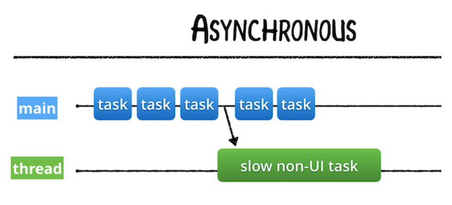
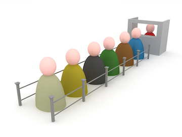

# Grand Central Dispatch (Part 1)

## How is it possible to have parallelism without concurrency?
> Concurrency - Handling many things at once (structure) [Can be done on software]
> Parallelism - How you handle many things. (execution) [Has to be concurrent, but it's more on a hardware level (such as the number of cores)]

* `Bit-level Parallelism` - Can be thought of as hardware-based parallelism.
* `Data Parallelism` — is parallelism inherent in program loops, which focuses on distributing the data across different computing nodes to be processed in parallel.
* `A Single instruction, multiple data` (SIMD) - is a class of parallel computers... with multiple processing elements that perform the same operation on multiple data points simultaneously.
* `Task Parallelism` — is the characteristic of a parallel program that entirely different calculations can be performed on either the same or different sets of data.
 * This contrasts with Data Parallelism, where the same calculation is performed on the same or different sets of data.

> Note that Concurrency is a type of Task Parallelism where tasks are divided (decomposed) into smaller bits for parallel processing.

### SIMD


# GCD and Operations

|  Grand Central Dispatch | Operations |
| ------------- | ------------- |
| A *lightweight* way to represent units of work that are going to be executed concurrently. GCD uses **closures** to handle what runs on another thread. |  Operations are **objects** that encapsulate data and functionality. Operations add a little *extra development overhead* compared to GCD. |
| The system takes care of scheduling for you. Adding dependencies, cancelling or suspending code blocks is labor intensive | Allow for greater control over the submitted tasks, including some control over scheduling through adding dependencies among various operations and can re-use, cancel or suspend them.  |
| GCD is good to use for simple, common tasks that need to be run only once and in the background. |  Operations make it easier to do complex tasks. Use them when you need (a) task reusability, (b) considerable communication between tasks, or (c) to closely monitor task execution. |

### And because Operations are build on top of GCD, it is important to master the lower-level API first...

> Note: Where Swift uses closures (functions) to handle the code that runs on another thread, C#, Typescript, Python, JavaScript and other languages use the the more common Async/Await pattern. The original plans for Swift 5.0 included adding the Async/Await pattern, but this was removed from the Swift specification until some future release.

# Why use GCD?
GCD's design improves simplicity, portability and performance.

* It can help you `improve your app’s responsiveness` by deferring computationally expensive tasks from the foreground (main thread) to the background (non-UI threads).
* It `simplifies` the creation and the execution of asynchronous or synchronous tasks.
* It’s a concurrency model that is `*much easier to work with*` than locks and threads.

> Asynchronous <br>
>

> Synchronous


# What does GCD do?
> GCD works by allowing specific `tasks` — functions or closures — that can be run in parallel to be `queued up` for execution and, depending on availability of processing resources, `schedule` them to execute on any of the available processor cores (referred to as "routing" by Apple). 1

> GCD abstracts the notion of threads, and exposes `dispatch queues` to handle `work items` (work items are blocks 2 of code that you want to execute). These tasks are assigned (dispatched) to a dispatch queue, which processes them in a `First-In-First-Out (FIFO) order`.

> Note: Apple's documentation sometimes refers to a block in lieu of a closure because block was the name used in Objective-C. In the context of concurrency in iOS, you can consider block and closure interchangeable> [action]

## Threads, Tasks & DispatchQueues in GCD
Grand Central Dispatch still uses threads at a low level but abstracts them away from the developer.

You work with threads by creating DispatchQueues.

### DispatchQueues

> In Computer Science, a queue is a data structure that manages a collection of objects in FIFO 3 order, where the first object added to the queue is the first object removed from (executed by) the queue.



In GCD, `DispatchQueue` is a queue object that manages the execution of tasks on your app's `main` thread or on a `background thread`.

It is a FIFO queue to which your application can submit tasks in the form of block objects (functions or closures).

`DispatchQueues`:

* maintain a queue of tasks and execute these tasks, either `serially or concurrently`, in their turn.
* `hide all thread management` related activities. (You can configure a queue, but you won’t interact directly with any thread associated with it.)
* are `thread safe`: They can be accessed from different threads simultaneously without locking. (Developers can use DispatchQueues to make their own code thread safe.)


Work submitted to `dispatch queues` executes on the `*pool of threads*` managed by the system.

Except for the dispatch queue (the `main queue`) representing your app's `main thread`, the system makes no guarantees about which thread it uses to execute a task.

**Thread Pools** Thread creation and destruction are expensive processes.

Instead of creating a new thread whenever a task is to be executed, then destroying it when the task finishes, available threads are taken from a pool of available threads created and managed by the operating system ([Thread Pool pattern](https://en.wikipedia.org/wiki/Thread_pool)).


### Tasks

Tasks in GCD:

* encapsulate code and data into a single object.
* are lightweight, easy to create, and easy to enqueue.
* can be expressed either as a function or as an anonymous "block" of code (eg, a closure).

# GCDPlay.playground
[link to playground](https://github.com/Make-School-Courses/MOB-2.3-Concurrency-Parallelism-in-iOS/tree/master/Lessons/02-Grand-Central_Dispatch-Pt1/assets/GCDPlay.playground)
```Swift
import Foundation

// New queue to test async and sync tasks.
let queue = DispatchQueue(label: "com.makeschool.queue")

// Sync to do something on the main thread, Async to run it on a separete thread.
//queue.sync { // Uncomment this line and comment the next if you want to switch task type.
queue.async {
    for i in 0..<10 {
        print("🍎 ", i)
    }
}

for i in 100..<110 {
    print("🐳 ", i)
}
```

### Asynchronous Print outcome
```
🐳  100
🍎  0
🐳  101
🍎  1
🐳  102
🍎  2
🐳  103
🍎  3
🐳  104
🍎  4
🐳  105
🐳  106
🐳  107
🍎  5
🐳  108
🐳  109
🍎  6
🍎  7
🍎  8
🍎  9
```

### Synchronous Print outcome
```
🍎  0
🍎  1
🍎  2
🍎  3
🍎  4
🍎  5
🍎  6
🍎  7
🍎  8
🍎  9
🐳  100
🐳  101
🐳  102
🐳  103
🐳  104
🐳  105
🐳  106
🐳  107
🐳  108
🐳  109
```

# Main Queue
* is a serial queue that's responsible for your UI. (We'll cover serial and concurrent queues in the next lesson.)
* is closely associated with the main thread and its call stack. The main queue only executes code on the main thread.

> Note: You should never perform UI updates on any queue other than the `main queue`.

## How the Main Queue Fits

Our updated diagram of the structure inside the runtime process of an iOS app simply illustrates that the `main queue` is associated directly with the `main thread` and its call stack, and that the system also creates queues for non-UI tasks.

1. When an iOS app starts, the system automatically creates the app's:
 * `main queue`
 * `main thread`
 * and the corresponding call stack that the `main thread` manages.
2. The `main thread`, again, allocates your app's `Application` object in its stack frame, which in turn executes its delegate methods on its AppDelegate object in their respective stack frames, and so on...
3. Notice that, though the system also creates a pool of additional threads for potential non-UI tasks and their corresponding call stacks, what actually happens is here is that **additional dispatch queues** are created (to which the system will assign a thread from the pool, as needed):


# DispatchQueue.main
> Pretty much time slicing.

```Swift
import Foundation

var value: Int = 2

DispatchQueue.main.async {
    for i in 0...3 {
        value = i
        print("\(value) ✴️")
    }
}

for i in 4...6 {
    value = i
    print("\(value) ✡️")
}

DispatchQueue.main.async {
    value = 9
    print(value)
}
```

### Output in playground
```
4 ✡️
5 ✡️
6 ✡️
0 ✴️
1 ✴️
2 ✴️
3 ✴️
9
```

## Making a deadlock

```Swift
// Somewhere inside a class...
let queue = DispatchQueue(label: "com.makeschool.queue")

// Somewhere in your function
queue.async {
  // Call slow non-UI methods here
  DispatchQueue.main.async {
    // Update the UI here
  }
}
```

### Never Call .sync on Current Queue

__*Do not call*__ the `dispatch_sync` (aka, `.sync`) function from a task that is executing on the same queue that you pass to your function call. Doing so will **deadlock** the queue.

If you need to dispatch to the current queue, __*do so asynchronously*__ using the `dispatch_async` (`.async`) function.

*Source: Apple docs*

A **deadlock.** occurs when two or more tasks are waiting on each other to finish and get stuck in a never-ending cycle. Neither can proceed until the other completes; but, since neither can proceed, neither will finish.

A **deadlock** can occur even when the perpetually-waiting tasks are on the same thread.


### Calling .sync on the Main Queue

You never want to execute something __*synchronously*__ against the `main queue`, unless it's related to actual UI work. Doing so could cause your app to crash or it might simply degrade your app's performance by locking your UI.

For example, this statement:

```Swift  
  DispatchQueue.main.sync {}
```

...will cause the following events:
1. `sync` queues the block in the `main queue`.
2. `sync` blocks the thread of the `main queue` until the block finishes executing.
3. `sync` will wait forever because the thread where the block is intended to run is blocked.

The key to understanding this is that `.sync` does not __*execute*__ tasks/blocks, it only __*queues*__ them. Execution will happen on a future iteration of the run loop.


*Source:* https://medium.com/swift-india/parallel-programming-with-swift-part-1-4-df7caac564ae

# Additional Topics

* `DispatchObject` - allow you to manage memory, pause and resume execution, define object context, log task data, and more.
* `DispatchWorkItem` - A DispatchWorkItem encapsulates work to be performed on a dispatch queue or within a dispatch group. You can also use a work item as a DispatchSource event, registration, or cancellation handler.
* `dispatchMain()` - This function "parks" the main thread and waits for blocks to be submitted to the main queue. 
