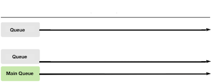

# Grand Central Dispatch (Part 2)

#### Class Topics:
* when to use `Synchronous` and `Asynchronous`
* `Sync` and `Deadlocks`
* `Critical Section`
* `Thread Safety`
* GCD's provided serial and concurrent `DispatchQueues`
* `QoS Priority`
* how the `Main Queue` fits in GCD

# Class Activity #1
## Part 1 (Fill Diagram)
You're making an app that will need to download and process a picture by adding a filter to it.
Diagram on the image how you would split the work between the Queues.

> Original<br>
<br>

## My Answer
> Completed<br>
<br>

## Part 2 (Analyze Code)
Examine the code in the snippet below:

```Swift  
func someFunction() {
  DispatchQueue.global().async {  // A) Run the following code block asynchronously on a non-UI thread
        let url = URL(string: imageUrl) // YOU CAN DOWNLOAD THE IMAGE HERE
        do {
            let data = try Data(contentsOf: url!)
                DispatchQueue.main.sync { // B) Run the code below synchronously on the main queue
                    self.imageIcon.image = UIImage(data: data) // YOU CAN APPLY FILTER HERE
                }
            }
  }
```

**Q:** What exactly is happening in this code?

**Answer:** At point `A)`, the code runs asynchronously on a background thread and &mdash; when done &mdash; it calls the `main queue` and tells it to run the code at `B)` *immediately* next (synchronously); in other words, it submits the block to the `main queue` and `.sync` tells the `main queue` to run the block immediately after the current function (`someFunction()`) completes (but after any system tasks already in the `main queue` have run).

**Q:** When might this be useful?

**Answer:** in `viewDidLoad()`, for example - updating the image immediately after the `viewDidLoad()` function runs, rather than allowing some other function in the ViewController to execute, might enhance the user experience...

*Source:* https://www.reddit.com/r/iOSProgramming/comments/7n9e9f/what_is_the_difference_between/

## Overview
**REVIEW OF SYNC AND ASYNC FRM LAST CLASS**
> In synchronous execution by sync method the current thread waits until the task finished before the method call returns. In asynchronous execution by async method, the method call returns immediately. Never call sync method in the main queue which will cause deadlock of the app. <br>

> Asynchronous tasks are started by one thread but actually run on a different thread, taking advantage of additional processor resources to finish their work more quickly. (from Apple ) <br>


### When to use Async?

In asynchronous execution by the `.async` method, the method call returns immediately, ordering the task to be done but not waiting for it to finish.

Asynchronous tasks are started by one thread but actually run on a different thread, taking advantage of additional processor resources to finish their work more quickly.

*from:* Apple docs

Use `.async` when your app does __*not*__ need to wait until the operation inside the block is finished.

As mentioned, **long-running tasks** such as image/data processing, local or remote data fetching, and other network calls are typically good candidates for running tasks `.async`.

If the `viewDidLoad()` method of your `View Controller` has too much work to do on the `main queue`, this can often result in long wait times before the view appears. If possible, it’s best to offload some work to be done in the background using `.async`, if it’s not absolutely essential at load time for the view.

### When to use Sync?

In synchronous execution by `.sync` method, the current thread waits until the task is finished before the method call returns.

Use `.sync` when your app needs to wait until a task is finished.

Example scenarios include:
- to ensure a particular function is not called a second time before its first invocation is finished.
- to wait for an operation inside a block to finish before you can use the data processed by the block.

#### Never Call .sync on Current Queue

__*Do not call*__ the `dispatch_sync` (aka, `.sync`) function from a task that is executing on the same queue that you pass to your function call. Doing so will **deadlock** the queue.

If you need to dispatch to the current queue, __*do so asynchronously*__ using the `dispatch_async` (`.async`) function.

*Source: Apple docs*

### Deadlock
> Deadlock Example<br>


A **deadlock** occurs when two or more tasks are waiting on each other to finish and get stuck in a never-ending cycle. Neither can proceed until the other completes; but, since neither can proceed, neither will finish.

A **deadlock** can occur even when the perpetually-waiting tasks are on the same thread.

> The key to understanding this is that .sync does not execute tasks/blocks, it only queues them. Execution will happen on a future iteration of the run loop. If the thread is blocked until some condition occurs (i.e., some block of code completes), no future iteration of the run loop can occur that condition is met and the queue and its thread are unblocked.

### The Main queue

When your app starts, a `main` dispatch queue is automatically created for you.

The `main queue`:
- is a *serial queue* that's responsible for your UI.
- is closely associated with the `main thread` and its call stack. The `main queue` *only* executes code on the `main thread`.

#### Main Queue vs Main Thread
&nbsp;&nbsp;&nbsp;&nbsp;&nbsp;&nbsp;&nbsp;  </br>

> Main Thread is managed by GCD. On the other hand, you can access and control the Queues.

## Key Concepts

Before we delve deeper into GCD's `DispatchQueues`, let's explore a couple of related concepts...

### Critical Section

Multiple, concurrent accesses to shared resources can lead to unexpected or erroneous behavior. So, parts of the program where the shared resource is accessed are protected from concurrent access.

This protected section is called the **critical section** (or **critical region**).

The code in the **critical section**:
- accesses shared variables/resources and has to be executed as an __*atomic*__ action.
- should **not be executed by more than one process at a time**.

Typically, the critical section accesses a shared resource &mdash; such as a data structure, a peripheral device, or a network connection &mdash; that would not operate correctly in the context of multiple concurrent accesses.

In the diagram below, if `Process 1` executes the code in the Critical Section to read a shared variable &mdash; while `Process 2` needs to write to the same variable &mdash;  `Process 1` might get either the old or new value of the variable:

&nbsp;&nbsp;&nbsp;&nbsp;&nbsp;&nbsp; 

> While a variable is used by one process, it cannot be accessed by another process.<br>

#### Examples of an atomic action.

##### Classic Example — A bank account shared by two people.
> If Person 1 checks the account balance at the same time that Person 2 executes some transaction (eg., withdraws money), that transaction may not be reflected in the balance that Person 1 sees.
To ensure the balance reported is always accurate, any code accessing the variable holding the balance can be protected from concurrent access.

##### A shared document.
> When two or more people are updating a shared document, access to the document can be temporarily limited to each active contributor — even if only for an instance — to prevent additional contributors from making changes before the doc is autosaved.
